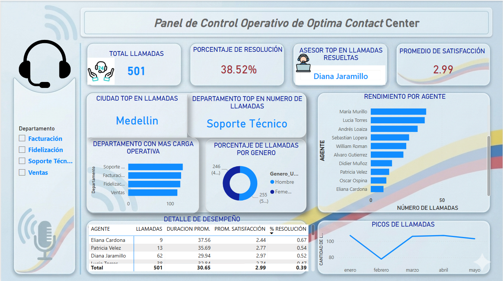

# Dashboard de Call Center

## Objetivo

Analizar el comportamiento operativo de un centro de contacto mediante indicadores clave de desempeño.

## Herramientas utilizadas

- Power BI
- Excel
- DAX

## Indicadores Analizados

- Total de llamadas
- Nivel de servicio
- Tiempo promedio de atención
- Tiempo promedio de espera
- Porcentaje de abandono

## Dashboard

## Conclusiones

- Pendiente de documentar.
